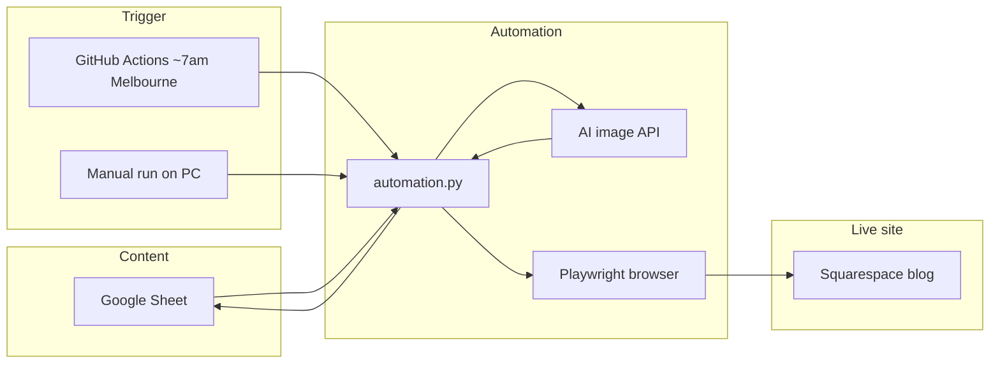

# Tribe Rural Logistics — Squarespace Blog Automation

Automated blog publishing for **[Tribe Rural Logistics](https://coconut-radish-an89.squarespace.com)**. The system reads post content from a **Google Sheet**, generates a professional hero image, creates the post in Squarespace, and **publishes it live** (not as a draft). Status in the sheet is updated automatically so your team always knows what was posted.

Design inspiration for layout and tone: [Metro Express blog](https://www.metroexpress.com.au/blog/).

---

## What this project does (client summary)

| Step | What happens |
|------|----------------|
| 1 | You add rows to a shared Google Sheet (title, body, date, status). |
| 2 | Once per day (or on demand), automation checks for **Pending** posts scheduled for **today or earlier** (Australia/Melbourne date). |
| 3 | For each eligible row, an **AI hero image** is generated to match the post title. |
| 4 | The bot opens Squarespace, fills **title** and **body** (sheet text plus a plain-text footer), uploads the **featured image**, and clicks **Publish**. |
| 5 | Column D in the sheet is set to **Posted** (or **Failed** if something went wrong, so you can retry). |

You control **what** gets published by editing the spreadsheet. You do not need to log into Squarespace for every post.

---

## Google Sheet

**Spreadsheet ID:** `18c9Ly0omriZ6hUUQQVPs4kRx7j_j46tavLtXHdG2jts`

Share this sheet with the Google service account email (from your `credentials.json` / `GOOGLE_CREDENTIALS` secret).

### Columns

| Column | Field | Description |
|--------|--------|-------------|
| **A** | Title | Blog post headline (also used as the image prompt). |
| **B** | Content | Main article text. Separate paragraphs with a blank line between them. |
| **C** | Date | When the post may go live. Formats like `21/05/26` or `21/05/2026` are supported. |
| **D** | Status | Workflow state (see below). |

### Status values

| Status | Meaning |
|--------|---------|
| **Pending** | Ready to publish when the date is today or in the past (Melbourne time). |
| **Processing** | Automation is working on this row (prevents double-posting). |
| **Posted** | Successfully published to the live site. |
| **Failed** | Something went wrong; fix the row or content and set back to **Pending** to retry. |

### Scheduling rules

- “Today” uses **Australia/Melbourne**, not UTC, so posts align with your local business day.
- A row with date **22/05/26** will not publish on **21/05/26**.
- Only rows with status **Pending** (case-insensitive) are considered.

### Footer added to every post

- **Bold** “Ready to book freight or a small move?”
- Clickable **Request a quote online →** link ([ClickUp form](https://forms.clickup.com/90161562352/f/2kz0rgqg-676/WM5FMNFXZQWBKHRIBF))
- Published date (from column C) and ABN line  
- Town in the footer matches the article (e.g. Benalla, not Mansfield)

---

## How it runs (automation schedule)



### GitHub Actions (production)

- **Workflow:** `.github/workflows/daily_post.yml` — **Daily Blog Poster**
- **Schedule:** every day at **21:00 UTC** (adjust in the workflow if you want a different time).
- **Manual run:** GitHub → **Actions** → **Daily Blog Poster** → **Run workflow**.

Squarespace often **blocks login from cloud servers**, so the workflow uses a saved browser session (`auth.json`) stored as a GitHub secret — not a password typed in the cloud every day.

---

## Project files

| File | Purpose |
|------|---------|
| `automation.py` | Main script: sheet → image → Squarespace → publish → update status. |
| `generate_session.py` | **One-time (or when session expires):** log in to Squarespace in a real browser and save `auth.json`. |
| `session_utils.py` / `shrink_auth.py` | Shrinks the session file so it fits GitHub’s secret size limit. |
| `requirements.txt` | Python dependencies. |
| `run.ps1` | Windows shortcut to install deps and run locally. |
| `run_tests.py` / `run_test.sh` | Safe layered tests using `.env.test` (test sheet + duplicate site). |
| `.env.test.example` | Template for test-only env vars (copy to `.env.test`). |
| `.github/workflows/daily_post.yml` | CI/CD workflow for daily posting. |

**Not in git (local / secrets only):** `auth.json`, `credentials.json`, `auth_github.txt`, `.env`

---

## One-time setup (technical / handover)

### 1. Google Sheets API

1. Create a Google Cloud service account with **Google Sheets API** enabled.  
2. Download the JSON key as `credentials.json` (local) or paste the full JSON into GitHub secret **`GOOGLE_CREDENTIALS`**.  
3. Share the spreadsheet with the service account email (Editor access).

### 2. Squarespace session (required for GitHub Actions)

Squarespace login from GitHub’s servers usually fails. Session must be created **on your own computer**:

```bash
pip install -r requirements.txt
playwright install chromium
python generate_session.py
```

1. A browser opens — log in to Squarespace (including 2FA if needed).  
2. When you see the dashboard, press **Enter** in the terminal.  
3. Open **`auth_github.txt`** (one line) and paste it into GitHub:  
   **Settings → Secrets and variables → Actions → `AUTH_JSON_BASE64`**

Re-run this when posts fail with “session expired” or login redirects.

Optional: `python shrink_auth.py` if you already have `auth.json` and only need a new secret line.

### 3. GitHub repository secrets

| Secret | Required | Description |
|--------|----------|-------------|
| `AUTH_JSON_BASE64` | **Yes** | Slim base64 session from `auth_github.txt`. |
| `GOOGLE_CREDENTIALS` | **Yes** | Full service account JSON (one line). |
| `SQ_EMAIL` | Optional | Squarespace email (fallback; CI normally uses `auth.json` only). |
| `SQ_PASSWORD` | Optional | Squarespace password (fallback). |
| `SPREADSHEET_ID` | **Yes** | Production Google Sheet ID (`18c9Ly0omriZ6hUUQQVPs4kRx7j_j46tavLtXHdG2jts`). |
| `POLLINATIONS_AI` | Optional | Pollinations API key (workflow maps to `POLLINATIONS_API_KEY`). |

### Daily schedule (7:00 Melbourne)

GitHub Actions uses **UTC** cron only. The workflow runs at **`0 21 * * *` (21:00 UTC)**, which is **07:00 the next calendar day** in **Australia/Melbourne** during **AEST** (standard time, roughly April–October). During **daylight saving (AEDT)** the same cron is **08:00** Melbourne; change the cron to `0 20 * * *` if you need exactly 7:00 year-round in summer.

Posting rules (unchanged):

- Only rows with status **Pending** and column C date **≤ today** (Melbourne).
- If any **Pending** row has column C **= today**, only those rows run; otherwise earlier dates backlog.

---

## Going live on GitHub (checklist)

Do this **after** local layers 1–3 pass on the **test sheet** and you are happy with the footer (bold + link) and featured image.

1. **Commit and push** this repo to `main` (or merge your PR).
2. **Refresh `AUTH_JSON_BASE64`** — on your Mac, after a successful `python generate_session.py`, paste the new line from `auth_github.txt` into GitHub → Settings → Secrets → Actions.
3. **Confirm secrets** — `GOOGLE_CREDENTIALS`, `AUTH_JSON_BASE64`. Optional: `SQ_EMAIL`, `SQ_PASSWORD`, `POLLINATIONS_AI`.
4. **`SPREADSHEET_ID` for testing vs live**
   - **GitHub smoke test (after push):** set `SPREADSHEET_ID` to the **test copy** ID: `13LSgjknAy0r6OFg4kER1SE5sFVTgfpjKMuHY75okvsk` (share that sheet with the service account).
   - **Daily production:** change the same secret to the **live** sheet: `18c9Ly0omriZ6hUUQQVPs4kRx7j_j46tavLtXHdG2jts`.
5. **Smoke test on GitHub (before relying on the clock)**  
   - Actions → **Daily Blog Poster** → **Run workflow**  
   - Set **test_row_limit** to `1`  
   - Ensure one row on that sheet is **Pending** with date **≤ today**  
   - Check the run log and the live blog post (bold footer, clickable quote link, image).
6. **Enable the daily run** — leave the schedule as-is for ~7:00 Melbourne; no further action unless you change the cron.
7. **Sheet workflow for your client** — set each day’s row to **Pending** before 7:00 Melbourne on that date (or earlier); automation sets **Posted** / **Failed**.

`DRY_RUN` cannot be used in GitHub Actions (by design). All CI runs are real publishes to the production site and sheet.

---

## Safe testing (Option D — production untouched)

Use a **copy of the Google Sheet** and a **duplicate Squarespace site** so the live Tribe blog and production spreadsheet are never published to or updated during tests.

| Layer | Command | What it does | Touches production? |
|-------|---------|--------------|---------------------|
| **1** | `python run_tests.py --layer 1` | Reads **test** sheet, builds body, saves image to `test_output/` | **No** (blocked if sheet ID is production) |
| **2** | `python run_tests.py --layer 2` | Opens **test** site editor, fills post, **does not publish** | **No** |
| **3** | `python run_tests.py --layer 3` | Full publish on **test** site + updates **test** sheet only | **No** (script refuses production IDs/URLs) |

### One-time test setup

1. **Google Sheet:** File → **Make a copy** → share with service account → put copy ID in `.env.test` as `SPREADSHEET_ID`.
2. **Squarespace:** Duplicate site (or trial) → put duplicate URL in `.env.test` as `BASE_URL`.
3. Copy config: `cp .env.test.example .env.test` and edit.
4. Session: same `auth.json` from `generate_session.py` (one login covers sites on your account).

```bash
cp .env.test.example .env.test
# edit .env.test
chmod +x run_test.sh
./run_test.sh 1    # layer 1
./run_test.sh 2    # layer 2 (visible browser: HEADLESS=false in .env.test)
```

### Safety guards (built into `automation.py`)

- **`DRY_RUN=1`:** never publishes; never writes column D (`Pending` / `Posted` / etc.).
- **Production sheet in dry run:** blocked unless `ALLOW_PRODUCTION_SHEET_READ=1` (read-only diagnostics only).
- **Production site in dry-run browser:** blocked unless `ALLOW_PRODUCTION_SITE=1` (not recommended).
- **GitHub Actions:** `DRY_RUN` is forbidden on the scheduled workflow.
- **Daily production job:** unchanged — no `.env.test`, no `DRY_RUN`.

Manual production run (unchanged): `python automation.py` with no test env vars.

After your friend sends the Google JSON: save it as `credentials.json` in this folder (**do not commit it**). Run `python check_setup.py` to confirm everything before layer 1.

---

## Running locally (for testing)

**Windows (recommended):**

```powershell
cd d:\projects\squarespace_automation
.\run.ps1
```

**Or manually:**

```bash
python -m venv .venv
.venv\Scripts\pip install -r requirements.txt
playwright install chromium
# Place credentials.json in the project folder
python automation.py
```

Local runs use a **visible browser** on Windows; GitHub Actions runs **headless**.

---

## Squarespace site details

| Item | Value |
|------|--------|
| Site | https://coconut-radish-an89.squarespace.com |
| Editor entry | Opens composer at `/edit` (new post canvas) |
| Publish flow | Publish dropdown → **Publish Now** / confirm — **no Save Draft** step before going live |

### Featured image

The bot uploads the generated JPEG through **Post Settings** (not the site-wide Settings gear). That thumbnail appears on the blog listing, similar to professional transport blogs.

### Images

- Source: [Pollinations.ai](https://image.pollinations.ai) (free tier; optional API key for `gen.pollinations.ai`).  
- Style prompt: professional Australian transport / logistics photography based on the post title.  
- Output: ~1024×1024 JPEG, validated before use.

---

## What your client should know

**Strengths**

- Consistent plain-text footer on every post (correct regional town when detected)  
- Clear sheet-based workflow (Pending → Posted / Failed)  
- Runs automatically every day without manual Squarespace login (after initial session setup)  
- Dates respect **Melbourne** business timezone  

**Operational notes**

- **Session expiry:** If automation stops logging in, re-run `generate_session.py` and update `AUTH_JSON_BASE64`.  
- **Failed rows:** Check GitHub Actions logs, set status back to **Pending** after fixing content or dates.  
- **Squarespace UI changes:** If Squarespace redesigns the editor, selectors may need a small code update.  
- **Images:** If the image API is down, the post may still publish without a thumbnail depending on the error path; check the sheet status and the live post.

**What is not automated**

- Writing blog copy (you provide text in the sheet)  
- Social media cross-posting  
- SEO metadata beyond what Squarespace defaults provide in the editor  

---

## Repository

- **GitHub:** [working078/squarespace_automation](https://github.com/working078/squarespace_automation)

---

## Support checklist

| Problem | What to do |
|---------|------------|
| “No pending posts” | Check column D is **Pending**, date ≤ today (Melbourne), title/body filled. |
| “Session expired” | Run `generate_session.py`, update `AUTH_JSON_BASE64`. |
| Row marked **Failed** | Open Actions log for that run; fix row; set status to **Pending**. |
| Post is draft, not live | Should not happen with current publish flow; contact developer if it does. |
| No image on live post | Re-run row; confirm Pollinations returned a valid JPEG in logs. |

---

*Last updated: May 2026 — Tribe Rural Logistics Squarespace automation.*
